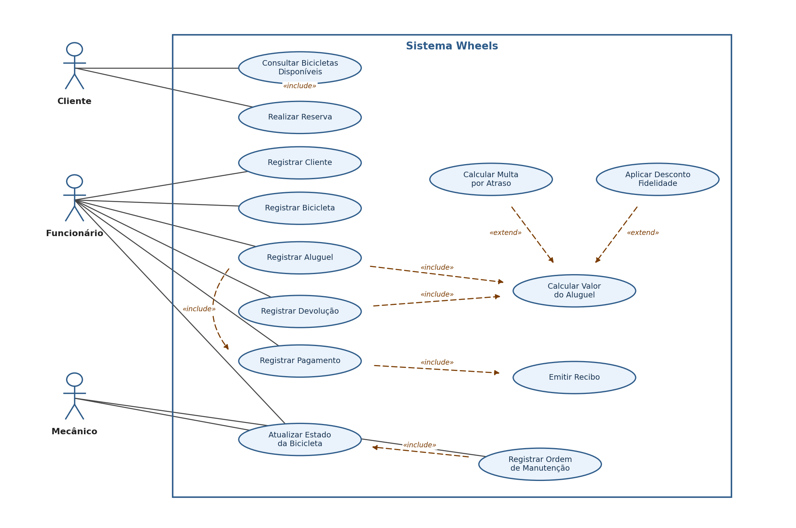
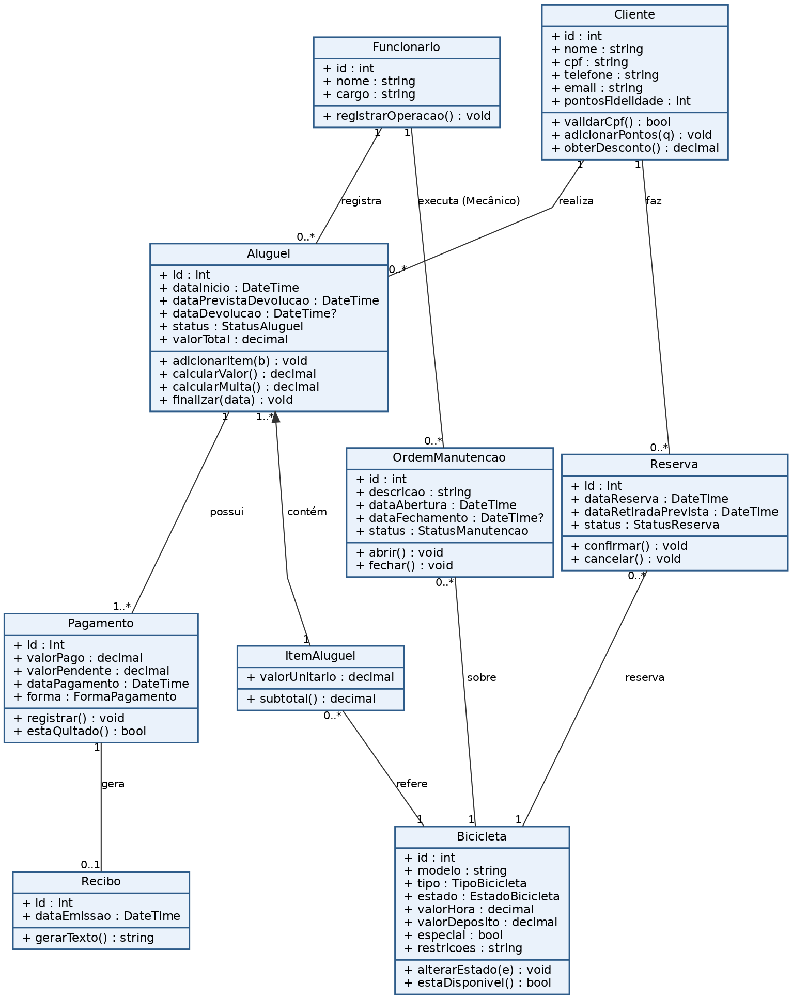
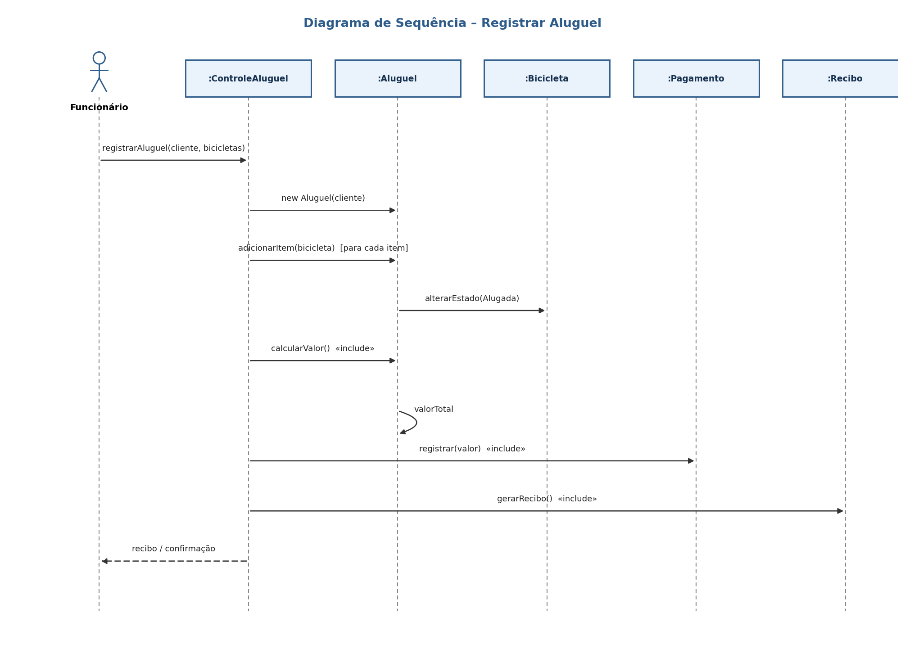

# 🚲 Wheels — Sistema de Aluguel de Bicicletas

Sistema web para gerenciar o aluguel de bicicletas de uma loja: cadastro de bicicletas e clientes, registro de aluguéis e devoluções, cálculo automático de valores e multas, programa de fidelidade, reservas e controle de manutenção.

Projeto desenvolvido em **C# / ASP.NET Core Razor Pages (.NET 8)** com persistência em **arquivos CSV**, seguindo o método **RUP** (Rational Unified Process). Trabalho de conclusão do Bloco 1 do curso de Análise e Desenvolvimento de Sistemas (Instituto Infnet).

---

## ✨ Funcionalidades

- Cadastro de **bicicletas** (tipo, valor por hora, depósito, estado) e de **clientes** (com validação de CPF).
- Registro de **aluguel** de uma ou mais bicicletas por cliente.
- **Devolução** com cálculo automático de **multa por atraso**.
- **Programa de fidelidade**: clientes acumulam pontos e recebem desconto progressivo (5% / 10% / 15%).
- Registro de **pagamento** e emissão de **recibo**.
- **Reserva** de bicicletas pelo próprio cliente (autoatendimento).
- **Ordens de manutenção** registradas pelo mecânico, alterando o estado da bicicleta.

---

## 🛠️ Tecnologias

- C# / .NET 8
- ASP.NET Core Razor Pages
- Persistência em arquivos CSV

---

## 🚀 Como executar

Pré-requisito: [.NET SDK 8.0](https://dotnet.microsoft.com/download) (ou superior — veja a nota abaixo).

```bash
cd WheelsRental
dotnet run
```

Abra no navegador o endereço exibido no console (por exemplo, `http://localhost:5000`).
Na primeira execução, alguns dados de exemplo (clientes, funcionários e bicicletas) são criados automaticamente. Os arquivos CSV ficam em `WheelsRental/App_Data/csv`.

> **Usando .NET 9 ou 10?** Abra `WheelsRental/WheelsRental.csproj` e troque `net8.0` pela sua versão (ex.: `net10.0`).

---

## 🏗️ Arquitetura

O projeto é organizado em quatro camadas, com responsabilidades bem separadas:

| Camada | Pasta | Responsabilidade |
|--------|-------|------------------|
| Modelos | `Models/` | Entidades de domínio e regras de cada classe (cálculo de valor, multa, desconto...). |
| Dados | `Data/` | Leitura e escrita dos arquivos CSV (repositório genérico + contexto). |
| Serviços | `Services/` | Regras de negócio (aluguel, reserva, manutenção). |
| Telas | `Pages/` | Interface web em Razor Pages. |

Fluxo de uma operação: **a tela chama o serviço → o serviço usa os repositórios para ler/gravar → os modelos fazem as contas.**

---

## 📐 Diagramas

Casos de uso (com relações *include* / *extend*):



Diagrama de classes:



Diagrama de sequência — Registrar Aluguel:



---

## 📸 Telas

Os prints do sistema em execução ficam em `docs/prints/`.

---

## 👤 Autor

**Victor Bueno Ravagnani** — Análise e Desenvolvimento de Sistemas, Instituto Infnet.
